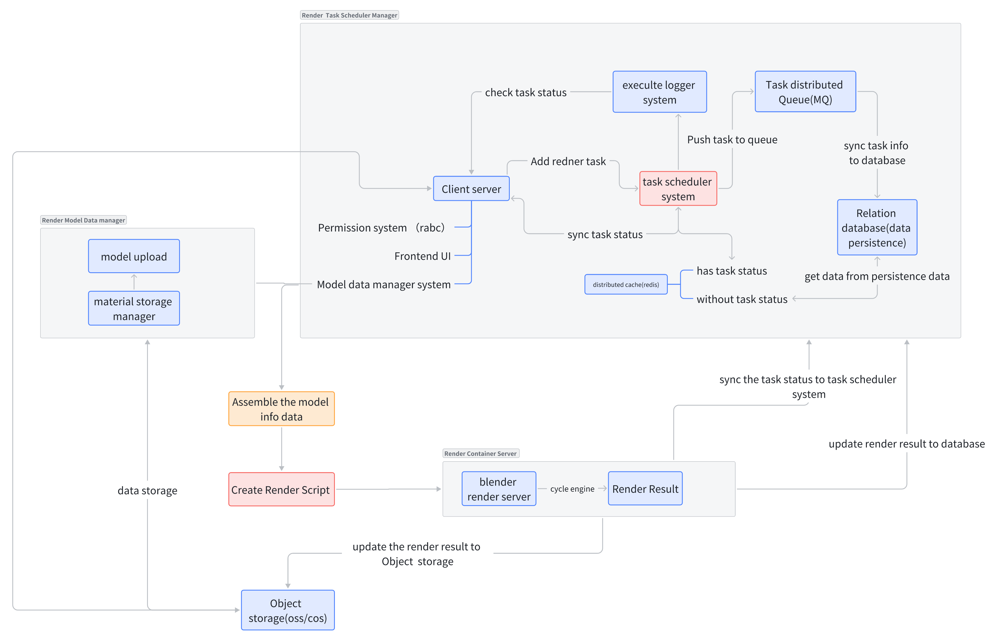
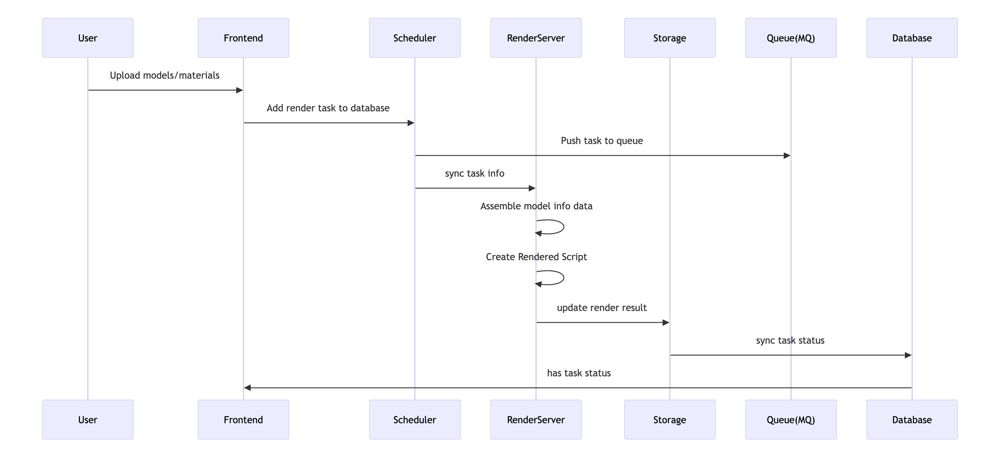

# Render Task Orchestration System


[中文文档](./docs/README_zh.md) 

## Description
This system is a Blender-based distributed rendering task orchestration platform that automates the complete workflow from model upload to rendered output storage through modular design. It employs a task queue scheduling mechanism to support high-concurrency rendering operations, with comprehensive status tracking and access control.


## Core Architecture Components




1. Data Storage Layer
​​Model/Material Storage​​: Handles user-uploaded 3D models and material files (OSS/COS object storage)
​​Relational Database​​: Stores rendering task metadata, user permissions, and system logs (labeled "database(data persistence)")
​​Distributed Cache​​: Redis-accelerated task status queries (labeled "distributed cache(id)")
2. Task Scheduling Layer
​​Message Queue (MQ)​​: RabbitMQ/Kafka for asynchronous task processing (labeled "Queue(MQ)")
​​Task Scheduler​​: RenderTask Scheduler Manager handles task allocation and load balancing
​​Execution Logger​​: executilelogger records end-to-end task states
3. Compute Service Layer
​​Render Container Cluster​​: Render Container Server runs Blender+Cycles engine in Docker containers
​​Script Generator​​: Create Rendered Script auto-generates Blender Python execution scripts
4. Management Interface Layer
​​Permission System​​: RBAC-based Permission system (rabec)
​​Frontend UI​​: Frontend UI provides task submission/monitoring interface
​​Model Manager​​: Model data manager system processes model metadata assembly

### Core Workflow



### Key Features
​​Status Synchronization​​:
Bidirectional state verification (sync task status ↔ check task status)
Multi-level state storage (DB + cache)
​​Fault Tolerance​​:
Automatic task retries
Atomic render result writes (update render result to database)
​​Security Controls​​:
Model access permission verification
Operation audit logging

## Deployment Guide

### Prerequisites

Before deploying the system, ensure you have the following installed:

- **Docker** 20.10+
- **Docker Compose** 2.0+
- **Node.js** 16.0+ 
- **npm** or **yarn**
- **PM2** (Process Manager)
- **Blender** 4.0+ (pre-installed in render images)

### Service Dependencies

The system requires the following services:

- **Redis** 6.2+
- **MySQL** 8.0+
- **RabbitMQ** 3.9+
- **Dufs** (File Server - temporary solution)

### Step-by-Step Deployment

#### 1. Infrastructure Setup

Start the required services using Docker Compose:

```bash
# Start all infrastructure services
docker-compose up -d

# Or start individual services
docker-compose up -d redis mysql rabbitmq dufs
```

#### 2. File Server Configuration

Configure the Dufs file server by modifying the volume mapping in `docker-compose.yml`:

```yaml
dufs:
  # ... other configurations
  volumes:
    - /your/desired/static/directory:/data  # Modify this path
```

**Important**: Replace `/your/desired/static/directory` with your actual static files directory path.

#### 3. Database Initialization

Initialize the database schema using Prisma:

```bash
# Generate Prisma client and initialize database
npx prisma generate
npx prisma db push  # or npx prisma migrate dev
```

#### 4. Application Deployment

Install dependencies and build the application:

```bash
# Install dependencies
npm install
# or
yarn install

# Build the application
npm run build
# or
yarn build
```

Start the application using PM2:

```bash
# Start the render service with PM2
pm2 start ./bootstrap.js --name render-service

# Check service status
pm2 status

# View logs
pm2 logs render-service
```

### Service Endpoints

After successful deployment, the following services will be available:

| Service | Port | URL | Description |
|---------|------|-----|-------------|
| Render Service | 3000 | http://localhost:3000 | Main application API |
| Redis | 6379 | localhost:6379 | Cache service |
| MySQL | 3306 | localhost:3306 | Database service |
| RabbitMQ Management | 15672 | http://localhost:15672 | Message queue management (admin/6653145) |
| RabbitMQ AMQP | 5672 | localhost:5672 | Message queue protocol |
| Dufs File Server | 5001 | http://localhost:5001 | Static file server |

### Configuration Notes

#### Database Configuration
- **MySQL Root Password**: `6653145`
- **Database Host**: `localhost:3306`
- Update your application's database connection string accordingly

#### Message Queue Configuration
- **RabbitMQ Username**: `admin`
- **RabbitMQ Password**: `6653145`
- **Management URL**: http://localhost:15672

#### File Server Configuration
- **Dufs serves static files** from the mapped directory
- **CORS enabled** for cross-origin requests
- **Upload/Download/Delete** permissions enabled
- Access via: http://localhost:5001

### Important Notes

⚠️ **Security Considerations**:
- Change default passwords in production environments
- Configure proper firewall rules
- Use HTTPS in production

⚠️ **File Storage**:
- Dufs is used as a **temporary file server solution**
- For production, consider using proper object storage (AWS S3, Alibaba OSS, etc.)
- Ensure sufficient disk space for model files and render outputs

⚠️ **Performance Tuning**:
- Monitor Redis memory usage
- Configure MySQL for your workload
- Adjust RabbitMQ queue settings based on rendering load

### Troubleshooting

#### Common Issues

1. **Port Conflicts**:
   ```bash
   # Check port usage
   netstat -tulpn | grep :5001
   
   # Modify ports in docker-compose.yml if needed
   ```

2. **Database Connection Issues**:
   ```bash
   # Check MySQL container logs
   docker-compose logs mysql
   
   # Verify database connectivity
   docker-compose exec mysql mysql -u root -p
   ```

3. **File Server Access Issues**:
   ```bash
   # Check Dufs container logs
   docker-compose logs dufs
   
   # Verify directory permissions
   ls -la /your/static/directory
   ```

### Development Mode

For development, you can start services individually:

```bash
# Start infrastructure only
docker-compose up -d redis mysql rabbitmq dufs

# Run application in development mode
npm run dev
# or
yarn dev
```

### Monitoring

Monitor your services:

```bash
# Check all container status
docker-compose ps

# Monitor PM2 processes
pm2 monit

# View application logs
pm2 logs render-service --lines 100
```

Usage Example
Upload model files via Frontend UI
System auto-generates task ID
Monitor real-time progress in task console:

# Task status API example
```
GET /api/tasks/{task_id}/status
```
Result files automatically saved to configured object storage